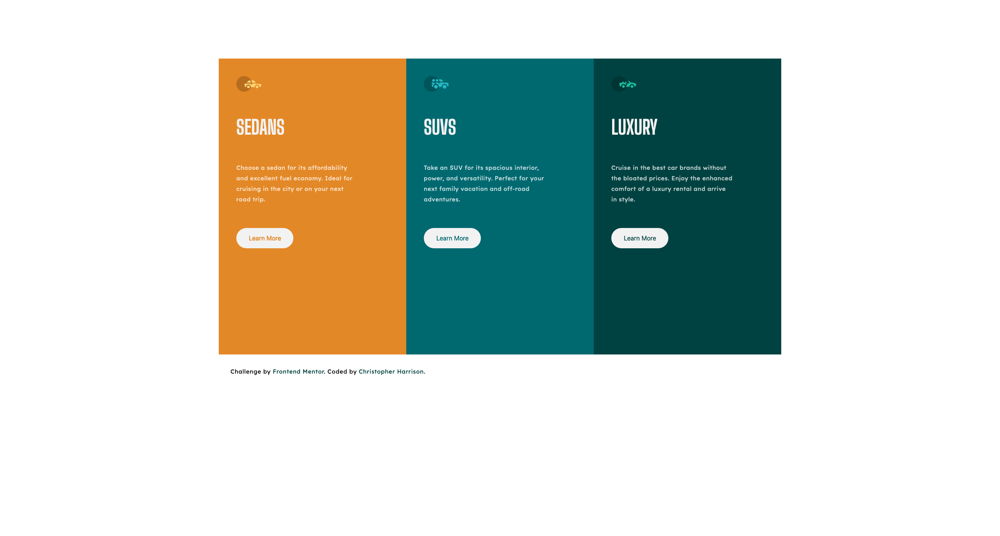

# Frontend Mentor - 3-column preview card component solution

This is a solution to the [3-column preview card component challenge on Frontend Mentor](https://www.frontendmentor.io/challenges/3column-preview-card-component-pH92eAR2-). Frontend Mentor challenges help you improve your coding skills by building realistic projects. 

## Table of contents

- [Frontend Mentor - 3-column preview card component solution](#frontend-mentor---3-column-preview-card-component-solution)
  - [Table of contents](#table-of-contents)
  - [Overview](#overview)
    - [The challenge](#the-challenge)
    - [Screenshot](#screenshot)
    - [Links](#links)
  - [My process](#my-process)
    - [Built with](#built-with)
    - [What I learned](#what-i-learned)
    - [Useful resources](#useful-resources)
  - [Author](#author)

**Note: Delete this note and update the table of contents based on what sections you keep.**

## Overview

### The challenge

Users should be able to:

- View the optimal layout depending on their device's screen size
- See hover states for interactive elements

### Screenshot

### Links

- Solution URL: [Add solution URL here](https://your-solution-url.com)
- Live Site URL: [Add live site URL here](https://your-live-site-url.com)

## My process
I used this challenge to practice my CSS Grid skills along with Flexbox. I just recently learned how to use grid and found this challenge to be very helpful in implementing what I learned.

### Built with

- Semantic HTML5 markup
- CSS custom properties
- Flexbox
- CSS Grid

### What I learned
I was able to continue to apply my learnings about a mobile-first approach to this design. I have really liked this approach, as it seems to help lessen the amount of media quiries that I need to use in order to get the website looking responsive and meeting design specifications. It was also fun to implement flexbox in conjunction with the grid and see how the two work nicely together. Specifically, I used grid to layout the design, and then used flexbox to design the sections holding the information about the cars.

### Useful resources

- [Wes Bos CSS Grid](https://cssgrid.io/) - I thought this was a great resource to learn about CSS Grid.

## Author

- Website - [Christopher Harrison](https://github.com/CKHarrison)
- Frontend Mentor - [@yourusername](https://www.frontendmentor.io/profile/CKHarrison)